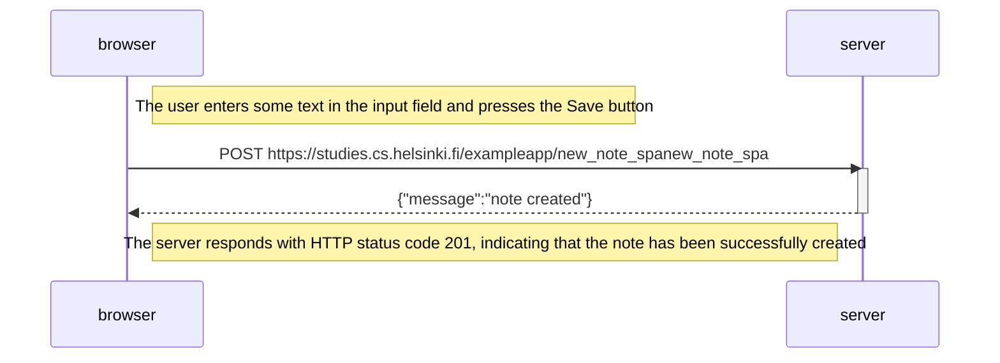

```mermaid
sequenceDiagram
    participant browser
    participant server

    Note right of browser: The user enters some text in the input field and presses the Save button
    browser->>server: POST https://studies.cs.helsinki.fi/exampleapp/new_note_spanew_note_spa
    activate server
    server-->>browser: {"message":"note created"}
    deactivate server
    Note left of server: The server responds with HTTP status code 201, indicating that the note has been successfully created
```